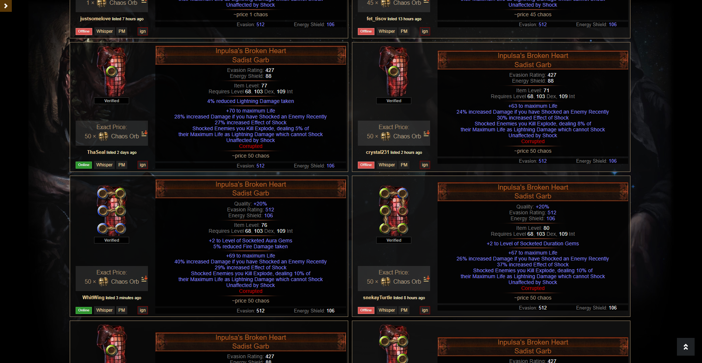
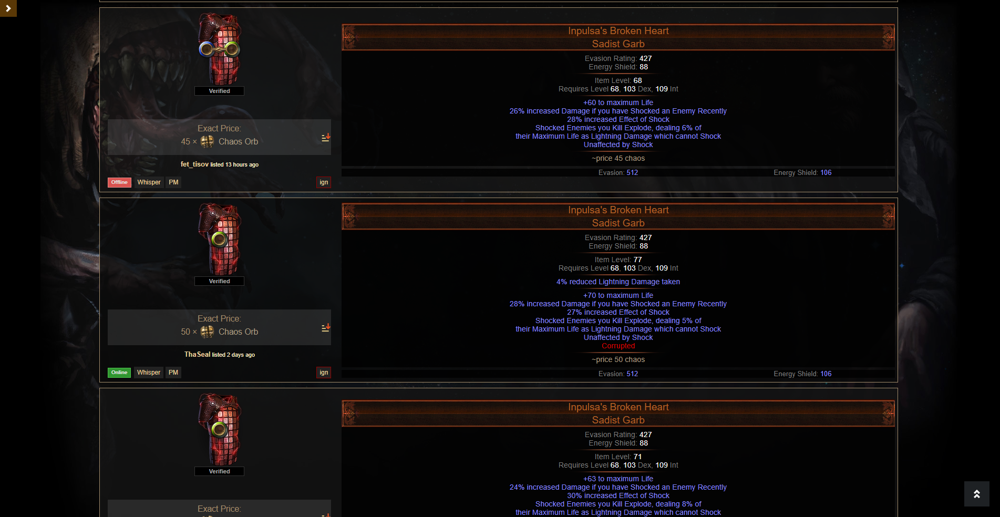

# Alternative trade layouts for pathofexile.com/trade

You'll need [greasemonkey](https://addons.mozilla.org/de/firefox/addon/greasemonkey/) for firefox or [tampermonkey](https://chrome.google.com/webstore/detail/tampermonkey/dhdgffkkebhmkfjojejmpbldmpobfkfo?hl=de) for google chrome.

There are currently two different versions:
Double Column Layout | Single Column Layout
--- | ---
 | 

Create a new script in either of both addons and copy the content of the layout you want to use into the newly opened window (and overwrite the existing content in it). After saving the script and reloading the trading website you should see the new layout.